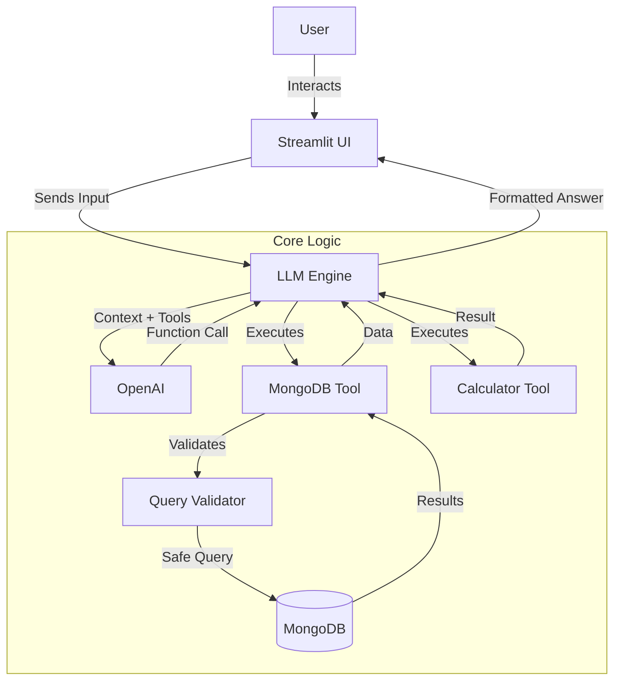

# Stock Trading Agent 

A powerful, conversational AI agent designed to help you analyze your stock holdings and trades using natural language. Built with **Google Gemini**, **MongoDB**, and **Streamlit**.

##  Overview

The **Stock Trading Agent** allows users to interact with their financial data naturally. Instead of writing complex databse queries, you can simply ask questions like:

- _"Show me my top 10 holdings by market value"_
- _"How many trades did I make last week?"_
- _"What is the distribution of my portfolio?"_

The agent intelligently translates these questions into MongoDB queries, executes them securely, and presents the results in a friendly, readable format.

##  Key Features

- **Natural Language Interface**: Chat with your data as if you were talking to an analyst.
- **Intelligent Query Generation**: Uses Google's Gemini models to understand intent and generate accurate MongoDB queries (Aggregation pipelines, Find, Count, Distinct).
- **Secure Execution**: Built-in `QueryValidator` ensures only safe, read-only operations are executed.
- **Chat History**: Persistent chat sessions stored in MongoDB so you can revisit past analyses.
- **Interactive UI**: Clean, responsive interface built with Streamlit.

##  Architecture

The application follows a modular architecture separating the UI, LLM logic, and data access layers.



### Data Flow

1.  **User Input**: The user asks a question via the Streamlit interface.
2.  **LLM Processing**: The request is sent to the `LLMEngine`, which forwards it to Google Gemini along with a schema of available tools.
3.  **Tool Selection**: If Gemini decides it needs data, it issues a `function_call` for `execute_mongodb_query`. If it needs to perform a calculation, it uses `execute_calculator`.
4.  **Validation**: For database queries, the `mongodb_tool` receives the query parameters and passes them to the `QueryValidator` to check for safety (e.g., no `drop`, `insert`, or injection attacks).
5.  **Execution**: Validated queries are executed against the MongoDB database. Mathematical expressions are safely evaluated.
6.  **Response**: Data or calculation results are returned to Gemini, which interprets the results and generates a natural language answer for the user.

## Project Structure

```
├── src/
│   ├── core/
│   │   ├── llm_engine.py       # Manages interaction with Google Gemini
│   │   ├── query_validator.py  # Security & validation logic for DB queries
│   │   ├── database.py         # MongoDB connection handler
│   │   ├── chat_model.py       # Pydantic models for chat history
│   │   └── config.py           # Application configuration
│   ├── tools/
│   │   ├── mongodb_tool.py     # Tool definition for LLM data access
│   │   └── calculator_tool.py  # Tool definition for Safe Math calculation
│   ├── ui/
│   │   └── app.py              # Main Streamlit application
│   └── prompts/
│       └── system_prompt.py    # System instructions for the Agent
├── .env.example                # Template for environment variables
└── requirements.txt            # Python dependencies
```

## Setup & Installation

### Prerequisites

- Python 3.10+
- MongoDB Instance (Local or Atlas)
- Google Cloud Project with Gemini API Access

### 1. Clone the Repository

```bash
git clone <repository-url>
cd realEstateAgent
```

### 2. Configure Environment

Create a `.env` file based on `.env.example`:

```bash
cp .env.example .env
```

Edit `.env` and fill in your details:

```ini
GOOGLE_API_KEY=your_gemini_api_key
MONGODB_URI=mongodb://localhost:27017/
DB_NAME=stock_data
LLM_MODEL=gemini-2.0-flash-exp  # or gemini-pro
```

### 3. Install Dependencies

```bash
pip install -r requirements.txt
```

### 4. Run the Application

```bash
streamlit run src/ui/app.py
```

## 🛡️ Security

This project implements a **Query Validator** (`src/core/query_validator.py`) to prevent prompt injection and accidental data loss:

- **Allowed Operations**: Only read interactions (`find`, `aggregate`, `count`, `distinct`) are permitted.
- **Blocked Commands**: Writes and destructive commands (`insert`, `update`, `drop`, `delete`) are strictly blocked.
- **Complexity Limits**: Caps the number of aggregation stages and result sizes to prevent DoS.
